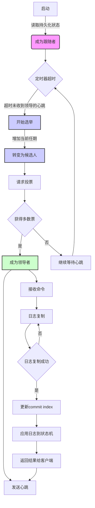
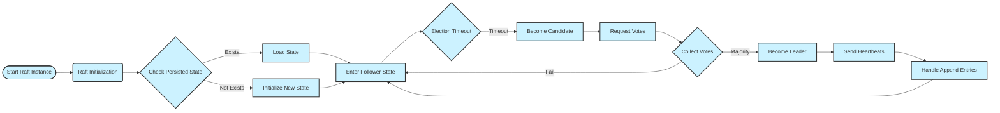

# Distributed-System

# Lab 2

```mermaid
graph TD
    A[启动] -->|读取持久化状态| B(成为跟随者)
    B --> C{定时器超时}
    C -->|超时未收到领导的心跳| D[开始选举]
    D -->|增加当前任期| E[转变为候选人]
    E --> F[请求投票]
    F --> G{获得多数票}
    G -->|是| H[成为领导者]
    H --> I[发送心跳]
    G -->|否| J[继续等待心跳]
    J --> C
    H --> K[接收命令]
    K --> L[日志复制]
    L --> M{日志复制成功}
    M -->|是| N[更新commit index]
    N --> O[应用日志到状态机]
    M -->|否| L
    O --> P[返回结果给客户端]
    P --> I

    style B fill:#f9f,stroke:#333,stroke-width:2px
    style D fill:#ccf,stroke:#333,stroke-width:2px
    style E fill:#ccf,stroke:#333,stroke-width:2px
    style H fill:#cfc,stroke:#333,stroke-width:2px
```

```mermaid
graph LR
    A([Start Raft Instance]) --> B(Raft Initialization)
    B --> C{Check Persisted State}
    C -->|Exists| D[Load State]
    C -->|Not Exists| E[Initialize New State]
    D --> F[Enter Follower State]
    E --> F
    F --> G{Election Timeout}
    G -->|Timeout| H[Become Candidate]
    H --> I[Request Votes]
    I --> J{Collect Votes}
    J -->|Majority| K[Become Leader]
    J -->|Fail| F
    K --> L[Send Heartbeats]
    L --> M[Handle Append Entries]
    M --> F
    
    classDef state fill:#ccf2ff,stroke:#333,stroke-width:2px;
    class A,B,C,D,E,F,G,H,I,J,K,L,M state;
```
